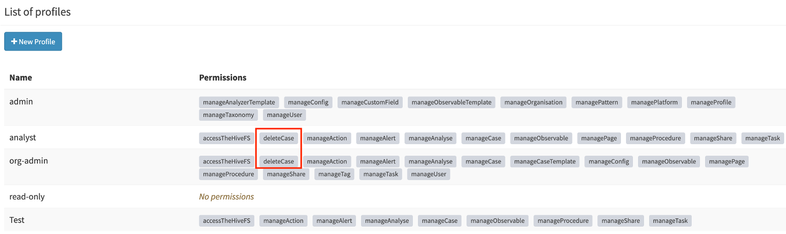
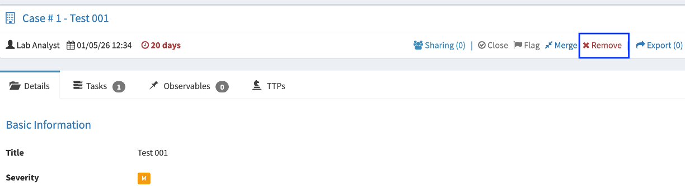
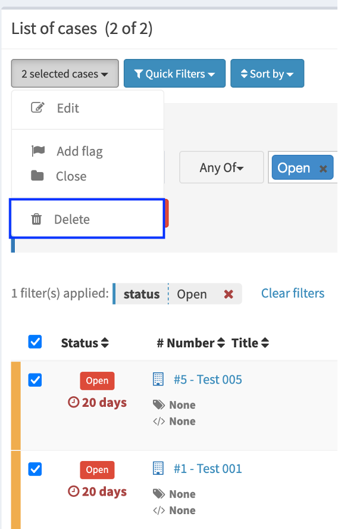
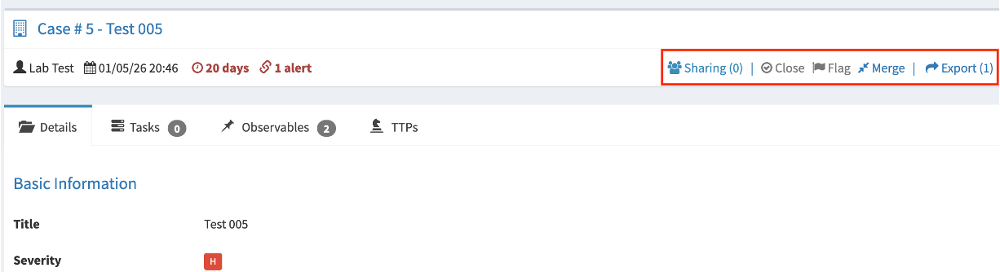
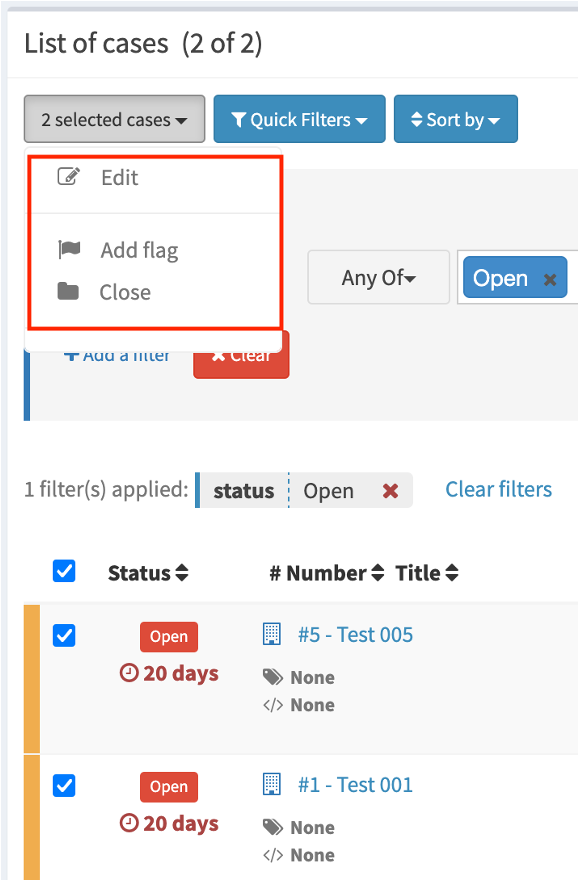
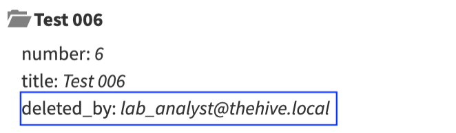

# Erletxea - TheHive Fork

Erletxea, “bee house” in Basque, is a personal project born from the idea of solving two limitations identified in the last open-source version of TheHive cybersecurity case management platform.

## Identified limitations

 - By design, the platform did not allow the admimistrator to define an analyst user role that could create and update cases but did not have privileges to delete them.
- The audit log generated by the platform, in relation to case management, recorded the user who had performed the action for all actions except the deletion of a case, limiting the traceability of this action.

## Creation of the deleteCase privilege

To address the first limitation, a privilege called “deleteCase” has been defined and added by default to the Analyst and Org-Admin profiles.
The model and the backend function responsible for deleting a case have been modified to allow this functionality only to users who have the “deleteCase” privilege (inherited from the assigned role).
Controls have been established in the frontend to show case deletion actions only to users who have the “deleteCase” privilege.

- Image 1: deleteCase Permission asigned to Analyst and Org-Admin Profiles

- Image 2: Frontend - Case delete options for users with deleteCase Permission

- Image 3: Frontend - Case delete options not available for users without deleteCase Permission

- Image 4: deletedBy info added to audit message

## Recovery of MISP integration features

TheHive 4 had integration features with the MISP platform, but ceased to function with modern versions of MISP (v>2.5).
In the analysis, we detected that modern versions of MISP send in their JSON responses several fields as Int instead of String, which was what TheHive expected.
In Erletxea, we adapted the code to correctly handle the responses received and thus recover the MISP integration features. 

## Support

I decided to share the code in case it may be useful to anyone but Erletxea is provided 'as is', without support.
TheHive 4 uses several obsolete libraries with known vulnerabilities, which I would like to replace in the future if time allows.

## References 

- TheHive project - https://github.com/TheHive-Project

